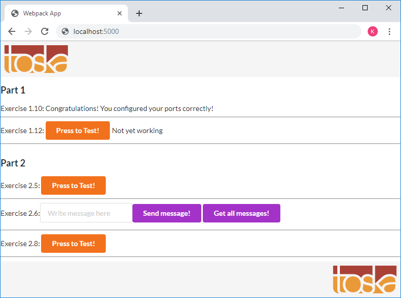

# Exercise 1.10

...

## The Dockerfile

Use node image as base
> FROM node

/app as work directory
> WORKDIR /app

We have two options:
* Make a git clone inside the image
* Copy the frontend from the host to the image

Option 1 : Get frontend code directly from github
> RUN git clone https://github.com/docker-hy/frontend-example-docker.git frontend

Option 2 : Copy frontend code from host
> COPY frontend-example-docker/ frontend/

Change workdir to the the frontend code
> WORKDIR /app/frontend

Install modules and build production code
> RUN npm install && npm run build

Expose port 5000 to host
> EXPOSE 5000

Start the webserver
> CMD [ "npm", "start" ]

## Building the image
> $ docker build -t myfrontend .

## Starting the container (map port 5000 inside container)
> $ docker run -p 5000:5000 myfrontend

When the container shows the info line
> INFO: Accepting connections at http://localhost:5000

we can with a browser navigate to http://localhost:5000 and see the page

