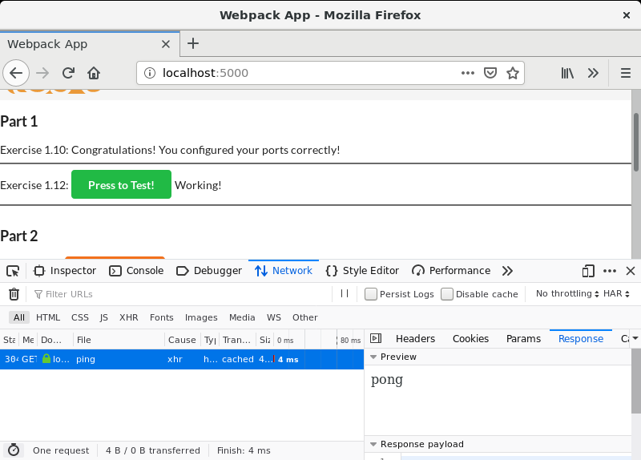

# Exercise 1.12

...

## The Dockerfiles

### Frontend

Use node image as base
> FROM node

Set backend api URL
> ENV API_URL=http://localhost:8000

/app as main directory
> WORKDIR /app

We have two options:
* Make a git clone inside the image
* Copy the frontend from the host to the image

Option 1 : Get frontend code directly from github
> RUN git clone https://github.com/docker-hy/frontend-example-docker.git frontend

Option 2 : Copy frontend code from host
> COPY frontend-example-docker/ frontend/

Change workdir to the the frontend code
> WORKDIR /app/frontend

Install modules and build production code
> RUN npm install && npm run build

Expose port 5000 to host
> EXPOSE 5000

Start the webserver
> CMD [ "npm", "start" ]

### Backend

Use node image as base
> FROM node

Set frontend URL for cross-origin allowance
> ENV FRONT_URL=http://localhost:5000

/app as work directory
> WORKDIR /app

We have two options:
* Make a git clone inside the image
* Copy the backend from the host to the image

Option 1 : Get backend code directly from github
> RUN git clone https://github.com/docker-hy/backend-example-docker.git backend

Option 2 : Copy backend code from host
> COPY backend-example-docker/ backend/

Change workdir to the the backend code
> WORKDIR /app/backend

Install modules
> RUN npm install

Expose port 8000 to host
> EXPOSE 8000

Start the webserver
> CMD [ "npm", "start" ]

## Building the images

### Frontend
> $ docker build -t myfront .

### Backend
> $ docker build -t myback .

## Starting the containers

### Frontend
Start the container as detached from the image (named as front). Also map port 5000 inside the container.
> $ docker run -d --name front -p 5000:5000 myfront

### Backend
Create an empty log file for first run
> $ touch logs.txt

Start the container as detached from the image (named as back). Map port 8000 inside the container. Also
map file logs.txt inside the container.
> $ docker run -d --name back -p 8000:8000 -v $(pwd)/logs.txt:/app/backend/logs.txt myback

## Checking docker status
Check both containers are running with
<pre>
<b>$ docker ps</b>
CONTAINER ID        IMAGE               COMMAND                  CREATED             STATUS              PORTS                    NAMES
1e283928ba3e        myfront             "docker-entrypoint.s…"   38 seconds ago      Up 37 seconds       0.0.0.0:5000->5000/tcp   front
d5fc91abd77e        myback              "docker-entrypoint.s…"   3 minutes ago       Up 3 minutes        0.0.0.0:8000->8000/tcp   back
</pre>

Now navigate with a browser to the frontend url http://localhost:5000

This will open the webpage, where a button for exercise 1.12 can be pressed. If the backend responses it will give a green button.
Also checking the network messages we can see the **ping** message and the **pong** answer.

