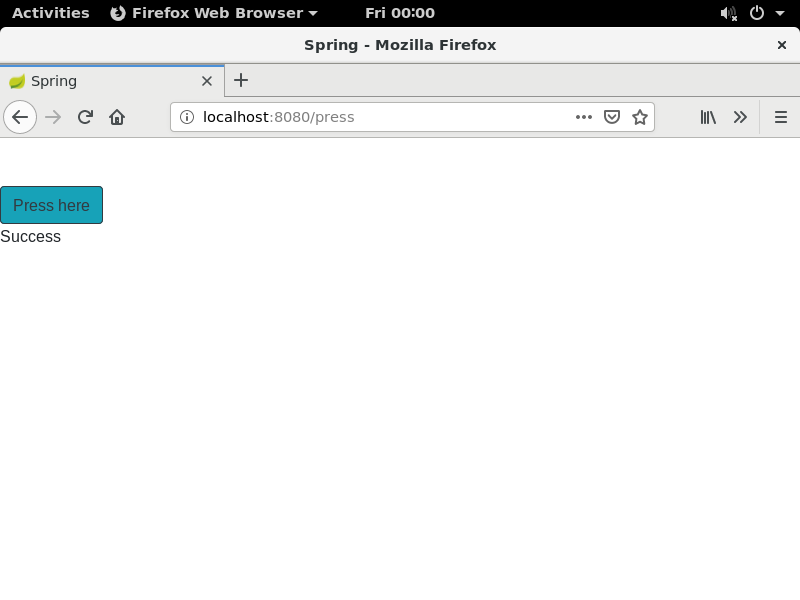

# Exercise 1.13

...

## The Dockerfile

Use openjdk version 8 as base image
> FROM openjdk:8

/app as main directory
> WORKDIR /app

Get spring code directly from github
> RUN git clone https://github.com/docker-hy/spring-example-project.git spring

Change workdir to the the spring code
> WORKDIR /app/spring

Build the project
> RUN ./mvnw package

Expose port 8080 to host
> EXPOSE 8080

Run the app at container start
> CMD [ "java", "-jar", "./target/docker-example-1.1.3.jar" ]

## Building the image

> $ docker build -t myspring .

## Starting the container

Start the container as detached from the image (named as spring). Also map port 8080 inside the container.
> $ docker run -d --name spring -p 8080:8080 myspring

## Checking docker status
Check container is running with
<pre>
<b>$ docker ps</b>
CONTAINER ID        IMAGE               COMMAND                  CREATED             STATUS              PORTS                    NAMES
4de6bcef44ff        myspring            "java -jar ./target/…"   3 seconds ago       Up 2 seconds        0.0.0.0:8080->8080/tcp   spring
</pre>

Now navigate with a browser to the frontend url http://localhost:8080

This will open the webpage, where a button can be pressed. When pressed we get a success message.

