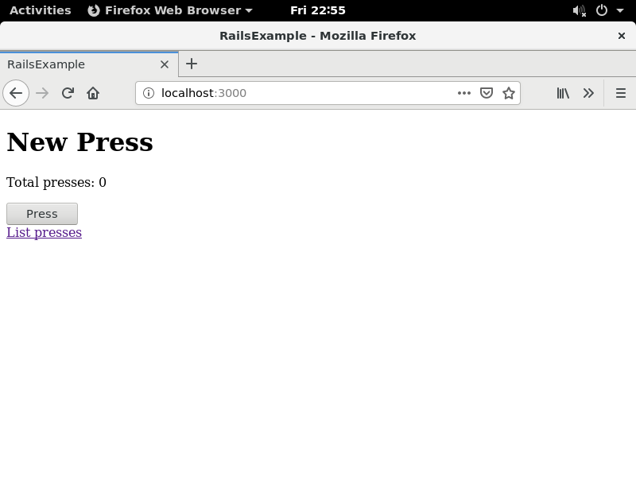
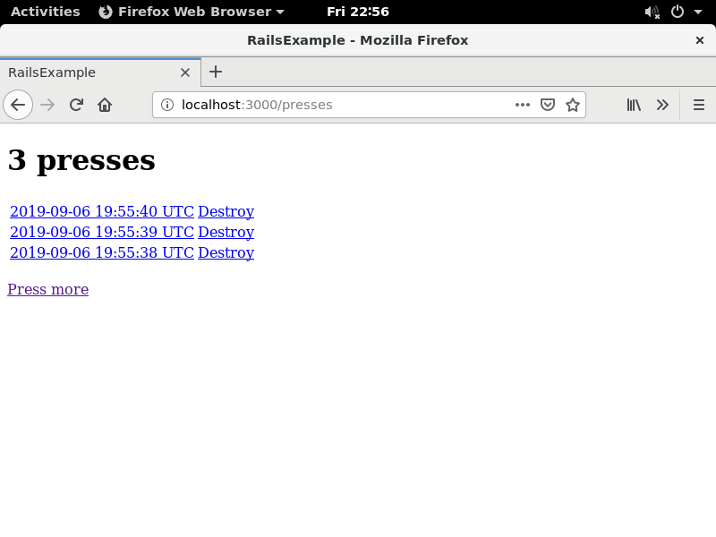

# Exercise 1.14

...


## The Dockerfile

Use ruby:2.6.0 as base image
> FROM ruby:2.6.0

Run multiple commands
* Update apt-get
* Run a curl based script to add nodejs apt sources to system
* Install nodejs
* Install yarn via npm (npm gets installed with nodejs). We need yarn to run rake assets:precompile
> ```
> RUN apt-get update \  
>   && curl -sL https://deb.nodesource.com/setup_10.x | bash - \  
>   && apt-get install nodejs --yes \  
>   && npm install yarn -g  
> ```

/app as main directory
> WORKDIR /app

Get rails code directly from github
> RUN git clone https://github.com/docker-hy/rails-example-project.git rails

Change workdir to the the rails code
> WORKDIR /app/rails

Run multiple commands to get rails installed and configured
* Install all dependencies
* export the SECRET_KEY_BASE needed during migration
* precompile the assets
* run migrations
> ```
> RUN bundle install \
>   && export SECRET_KEY_BASE=$(RAILS_ENV=production rake secret) \
>   && rake assets:precompile \
>   && rails db:migrate RAILS_ENV=production
> ```

We need the SECRET_KEY_BASE to be exported so rails can start. For this a script is needed.
> COPY start.sh .

Expose port 3000 to host
> EXPOSE 3000

Run the script at container start
> CMD [ "./start.sh" ]


## The start.sh script

A script is needed as rails is missing an export to be able to start.
> #!/bin/sh
>
> export SECRET_KEY_BASE=$(RAILS_ENV=production rake secret)
>
> rails s -e production


## Building the image

> $ docker build -t myrails .


## Starting the container

Start the container as detached from the image (named as rails). Also map port 3000 inside the container.
> $ docker run -d --name rails -p 3000:3000 myrails

## Checking docker status
Check container is running with
<pre>
<b>$ docker ps</b>
CONTAINER ID        IMAGE               COMMAND             CREATED             STATUS              PORTS                    NAMES
ac833918bf53        myrails             "./start.sh"        12 seconds ago      Up 9 seconds        0.0.0.0:3000->3000/tcp   rails
</pre>

Now navigate with a browser to the frontend url http://localhost:3000

This will open the webpage, where a button can be pressed.



Checking the logs to check the button pressing is working.


