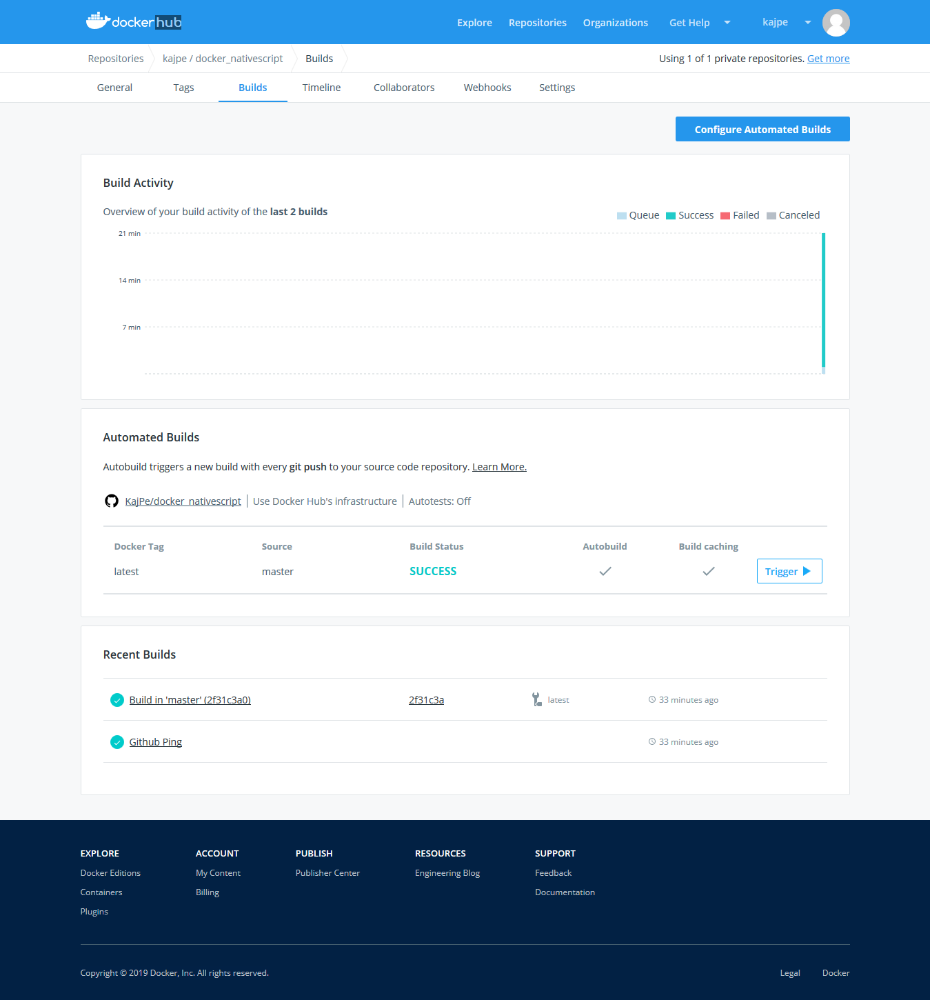

# Exercise 1.15

...

There is a project named docker_nativescript at  
> https://github.com/KajPe/docker_nativescript

Nativescript is an environment to develop and build android applications directly to an attached device with javascript, Vue or Angular. 

The project has a Dockerfile and README.md explaining the usage of the image.  

The built image can be found on docker hub at  
> https://hub.docker.com/r/kajpe/docker_nativescript

Docker hub has been configured to automatically build the image on a git push.

Below is a screenshot how the image build has succeeded on docker hub.

